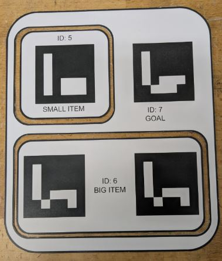
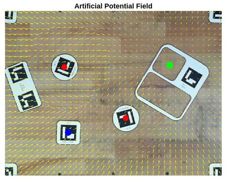
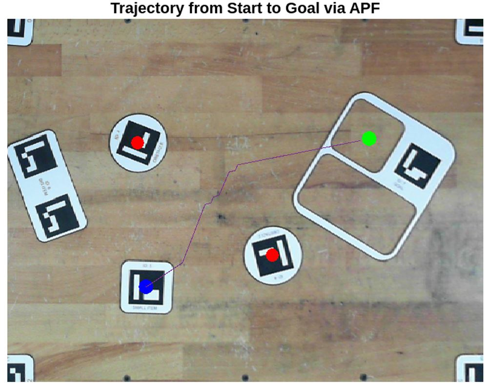

# UR5e Jigsaw Puzzle Solver

2-piece jigsaw pick-and-place demo using a table-top camera in the UR5e workspace with vacuum grippers.



---

## Overview

This project shows a full vision-to-robot pipeline for solving a small jigsaw-style puzzle:

- A top-down camera observes a board, two puzzle pieces and several obstacles.
- Fiducial markers are used to estimate the pose of the pieces and goal slots in the **UR5e base frame**.
- A path planner generates a collision-free trajectory for each piece.
- The UR5e, equipped with a vacuum gripper, picks the pieces and places them into their goal slots.  



The jigsaw board, items and obstacles follow the tabletop layout shown.

---

## Features

- **Vision & Coordinate Frames**
  - Detects ArUco / table markers in a webcam image.
  - Computes a homography from camera frame to robot base frame.
  - Estimates the pose of:
    - Small piece
    - Large piece
    - Goal locations
    - Obstacles

- **Path Planning**
  - Small piece moved using an **artificial potential field (APF)** planner:
    - Attractive potential to the goal.
    - Repulsive potentials around obstacles.
    - Discretised path in the robot XY plane (mm resolution).
  - Large piece moved using a separate planner (e.g. straight-line with obstacle checks or a custom planner).



- **Robot Execution**
  - Trajectories are lifted to 3D tool poses at a fixed height above the table.
  - Vacuum gripper control for pick and place.
  - Simple visualisation of paths, obstacles and goal regions.

---

## Repository Structure

- `fullProject.m`  
  Single MATLAB script that contains the full pipeline:
  - Vision processing and coordinate transforms.
  - APF field construction and path integration.
  - Pick-and-place execution for the small and large pieces.
  - Basic plotting / debugging figures.

- `example_1.jpg`  
  Example top-down image of the gameboard used for testing.


---

## Getting Started

1. Clone the repository:

```bash
git clone https://github.com/darshan-k-s/UR5e_Pick_and_Place.git
cd UR5e_Pick_and_Place
```

2. Open the folder in MATLAB and add it to the path:
```bash
addpath(genpath(pwd));
```

3. Requirements (typical setup):
- MATLAB with Computer Vision Toolbox (for camera and marker detection).
- Robotics Vision Toolbox or similar (for transforms / plotting, if used).
- A UR5e robot or URSim instance reachable on your network.
- RTDE MATLAB client on the path for streaming robot commands.

4. Configure the connection parameters (robot IP, ports, RTDE paths) near the top of fullProject.m to match your setup.

---

## Usage
1. In MATLAB, run:
```bash
fullProject
```

2. Follow the prompts in the Command Window to:
- Acquire or load a tabletop image.
- Run the vision module to detect board, pieces and obstacles.
- Visualise the APF field and the resulting path for the small piece.
- Execute pick-and-place motions for the small and large pieces with the UR5e.

3. Use `example_1.jpg` if you want to quickly test the vision and planning stages without a live camera.

This repository is intended as a compact demonstration of integrating camera-based perception, simple path planning and UR5e manipulation for table-top pick-and-place tasks.
